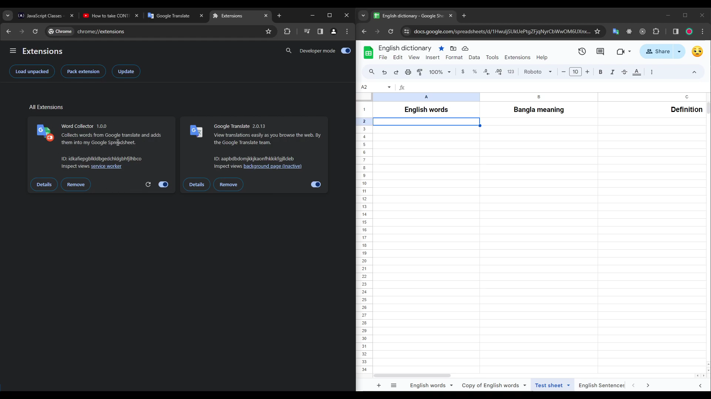
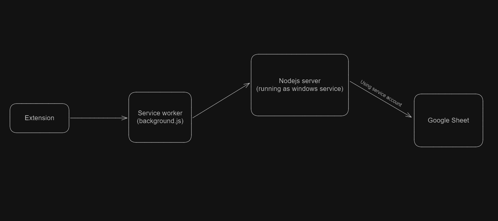
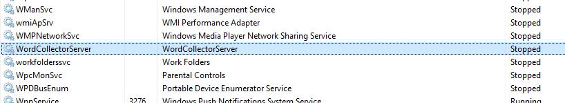

# Overview

This Chrome extension is a fun project I’ve been working on recently. The reason I've built it is that many times when I’m reading a documentation or watching a video, I don’t understand some words. So I would copy and paste (btw, for videos on YouTube, you can’t select words from subtitles) them into Google Translate and save them into Google Sheets for later memorization. Sometimes, I would save a word with multiple translations, sometimes with definitions and even sometimes with some examples for better understanding. This manual work was tedious for me as I had to do the same thing again and again. So I decided to make a Chrome extension for this exact purpose and here it is.

### Key features

- It can read, add, update, and delete words from my Google Sheets.
- Now I can select subtitles from YouTube videos and can translate and save them in sheet while watching videos.
- And btw, I also added a feature where I can select a text and search it on YouTube direcly (just select any text in browser, `right click` and you will see an option called `Seach YouTube for "[selected text]"` in context menu). I know it's irrelevant to this project but I needed it and it helps me a lot.

### Technologies

- The extension is built on HTML, CSS, and JavaScript.
- And for the Backend REST API, I’ve used Node and Express.

### Things that I got to learn

- How to build a Chrome extention from scratch and how it works
- How to scrap the web using `puppeteer-core` library
- How to work with `MutationObserver` API
- How to work with `Google Workspace` APIs specially with `Google Sheet` API using `googleapis` library in Nodejs and how to use a `service account` to interact with them

### Demo video

Watch this quick demo video (click the image)
[](https://youtu.be/6u6_iaAoX1E)

### How the extension works

So basically every CRUD action is sent to the service worker i.e. background.js from where it is sent to the Nodejs server which is running as windows service on the local machine. From there, it modifies the sheet accordingly using a service account (It's like a bot, modifying the sheet on your behalf). Look at this picture below


### Future plan

I'm going to build a windows application using Python or Electron.js which will pick up 5 or 10 most recently added words from the sheet and ask me for the meanings every time I turn on my PC. Thus strengthening my memory.

# Getting started

### Prerequisites

- Should know HTML, CSS, JavaScript and basic DOM manipulations
- Bacics of [Chrome extension development](https://developer.chrome.com/docs/extensions/get-started/tutorial/hello-world)
- Should know Nodejs and Express web framework
- [How to use Google Sheet API with a service account](https://medium.com/@shkim04/beginner-guide-on-google-sheet-api-for-node-js-4c0b533b071a)
- Basics of web scraping using `puppeteer-core` library

### Setting up extension locally

To run the extension locally, first go to [chrome://extensions](chrome://extensions) page and turn on `Developer mode` and then click `Load unpacked` button to upload the _extension_ folder.

### Setting up the server

Navigate to the _server_ folder and run `npm run install` to install all the necessary dependencies. After that, run `npm run dev` and the server will run on http://localhost:4137. Make sure you have renamed your service account's key file to `service-account-creds.json` or just copy and paste your creds into that file.

# Production

For the extension, you can upload it on the Chrome web store or use it locally. And for the server, it's up to you how you want to run it. What I did was I converted the server into an executable using [pkg](https://github.com/vercel/pkg?tab=readme-ov-file) and had it run on startup by making it a windows service using [nssm](https://nssm.cc/). And that is the recommended way.

### How to convert into executable

First install `pkg` by running `npm install -g pkg` command in the terminal. Navigate to the _server_ folder and add these lines to `pakage.json`

```
"bin": {
    "index": "./server.js"
  },
  "pkg": {
    "assets": [
      "node_modules/vm2/**/*"
    ],
    "targets": [
      "node18-win-x64"
    ]
  }
```

Now run `pkg .` and after some time, you'll see an exe file in the root directory of the _server_ folder. Remember, `settings.json` and `service-account-creds.json` files won't be packaged into executable. So if you don't move these files and convert the server into an exe then they have to be in the same root folder where the exe file is. Otherwise the extension will not work properly.
```
WordCollector/
 ├── word-collector-server.exe
 ├── service-account-creds.json
 └── settings.json
```
### How to run the server as a windows service
Download [nssm](https://nssm.cc/download) and Navigate to the folder where the nssm exe is. Open CMD as administrator and run `nssm install [service name] [path to the server exe]`
for example, `nssm install WordCollectorServer C:\WordCollector\word-collector-server.exe`.
After that, you'll see a message that says `Service "WordCollectorServer" installed successfully!`

Now run `nssm start [service name]` and I'll start running in the background. And from now on, I'll run automatically every time you turn on the PC. Note that if you move the server folder (assuming the folder name is _WordCollector_) elsewhere, then windows service won't work anymore.
